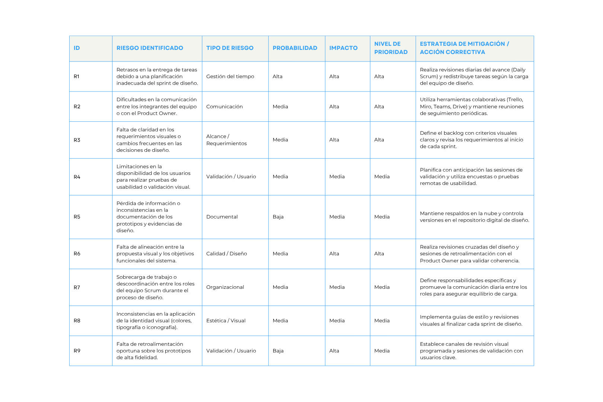

# 03. Matriz de riesgos

La gestión de riesgos permite anticipar y mitigar los posibles eventos que podrían afectar el desarrollo del proyecto.  
Los riesgos se clasifican según su probabilidad de ocurrencia y su impacto en los objetivos del proyecto, junto con estrategias para su mitigación.

## Matriz de riesgos

Enlace: https://www.canva.com/design/DAG09NmSdio/8XT-iXKl7gxstRhwrtGM9w/view

## Análisis general
Los riesgos más críticos están asociados con la validación de prototipos, la retroalimentación de usuarios y la alineación del diseño con los objetivos funcionales.  
El uso de la metodología **Scrum** permite planificar de forma iterativa, reducir incertidumbres y garantizar la mejora continua durante cada sprint.