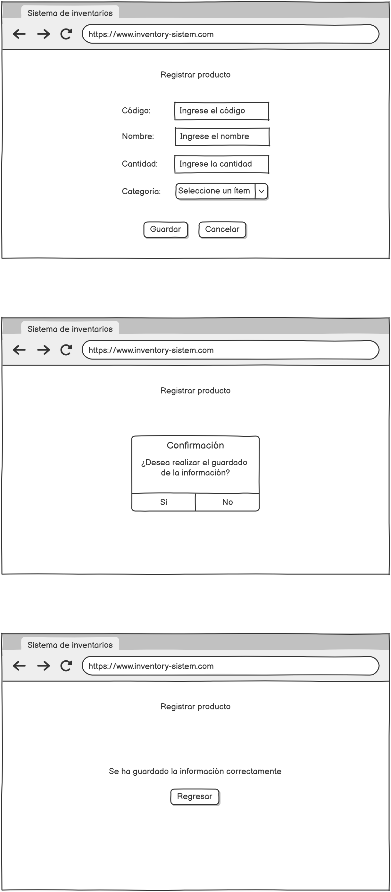
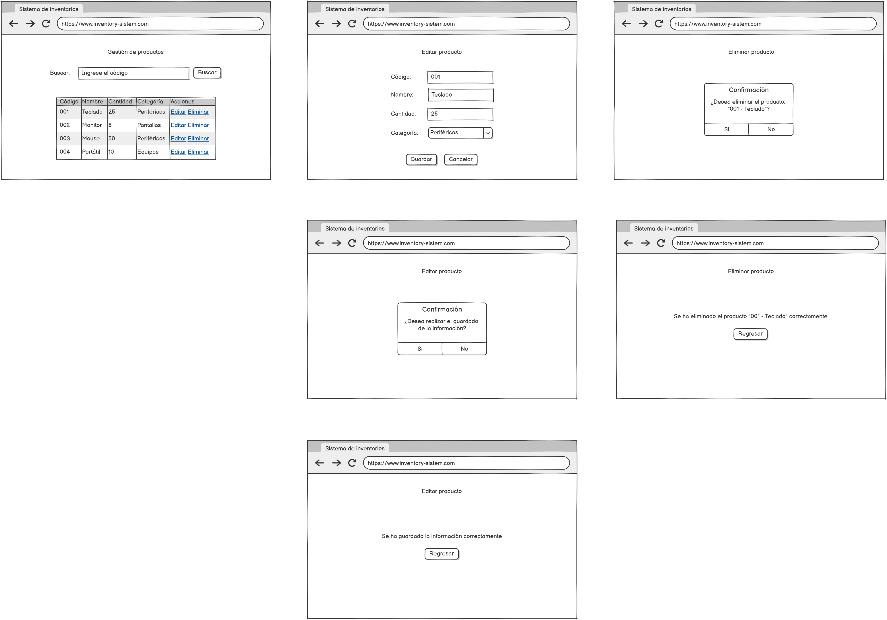
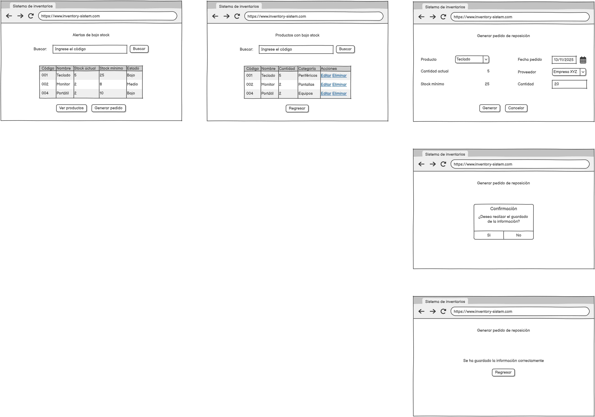
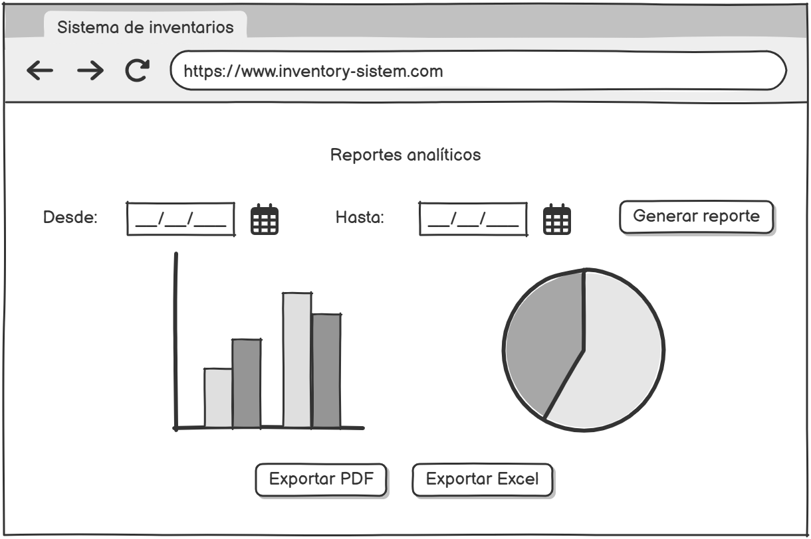
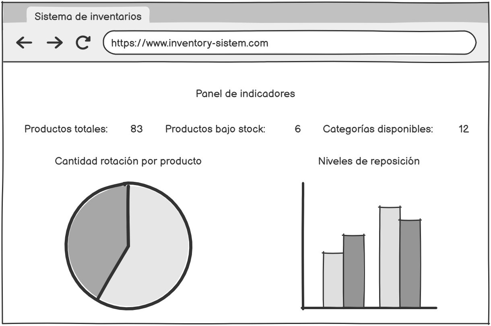
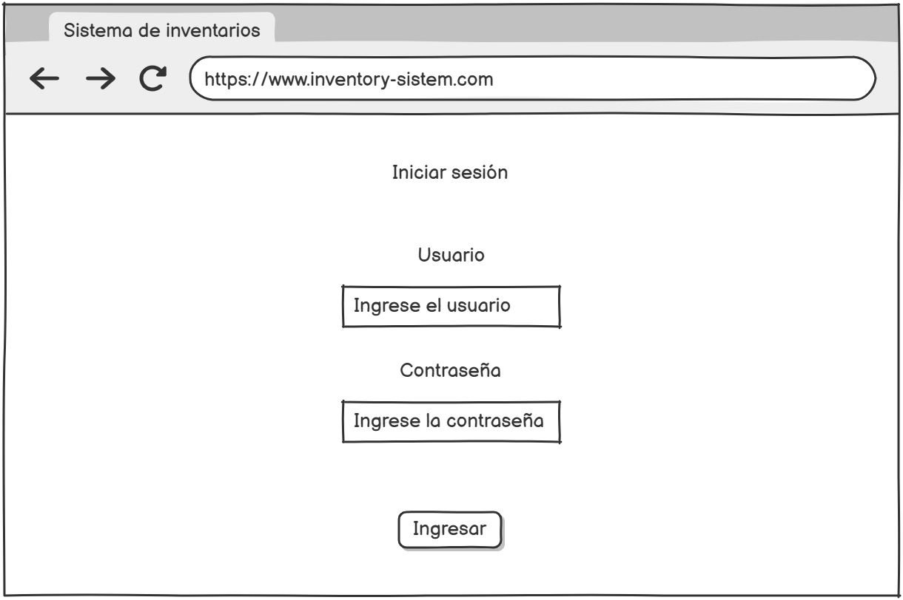

# 06. Prototipo de baja fidelidad

A continuación, se presenta el prototipo de baja fidelidad elaborado en Balsamiq, el cual incluye las plantillas correspondientes a las seis pruebas de usuario descritas a continuación.

---

### HU-01: Registrar producto

---

### HU-02: Editar y eliminar productos

---

### HU-03: Alertas de bajo stock

---

### HU-04: Reportes analíticos

---

### HU-05: Panel de indicadores

---

### HU-06: Inicio de sesión

---

### Enlace al prototipo en Balsamiq
https://balsamiq.cloud/sx2qpt5/pplhgo4
